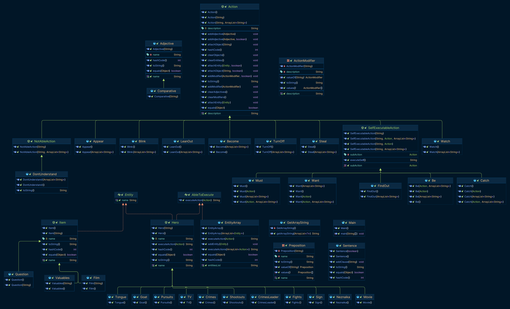

# Programming_Lab3

> Незнайка и Козлик смотрели фильм с середины и никак не могли понять, где и какие ценности преступники похитили.
> Им все же почему-то хотелось выяснить этот вопрос.
> В то же время им чрезвычайно интересно было узнать, поймают в конце концов преступников или нет.
> Картина между тем становилась все напряженнее и стремительнее.
> Одна за другой возникали головокружительные погони, массовые драки и оглушительные перестрелки.
>  На самом интересном месте, когда главаря шайки вот-вот должны были схватить, телевизор вдруг выключился, вверху снова высунулся язычок и замигала надпись: "5 сантиков".

