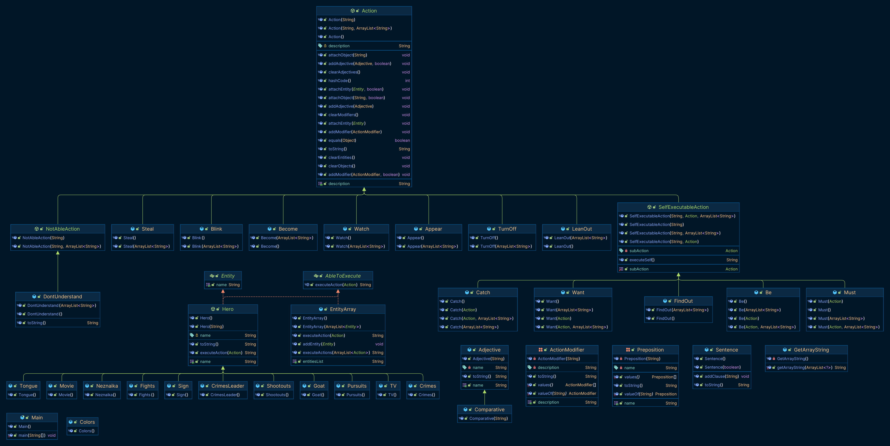

# Class structure for lab #3

Незнайка и Козлик смотрели фильм с середины и никак не могли понять, где и какие ценности преступники похитили. Им все же почему-то хотелось выяснить этот вопрос. В то же время им чрезвычайно интересно было узнать, поймают в конце концов преступников или нет. Картина между тем становилась все напряженнее и стремительнее. Одна за другой возникали головокружительные погони, массовые драки и оглушительные перестрелки. На самом интересном месте, когда главаря шайки вот-вот должны были схватить, телевизор вдруг выключился, вверху снова высунулся язычок и замигала надпись: "5 сантиков".

3. Item - abstract class
   1. MoonStone
2. lab3.Place - abstract class
   1. Room 
   2. 
3. lab3.Action - interface
   1. Explain
   2. Lie
   3. Cover
   2. 
   3. Disappear
   4. Talk
   5. DisLike
   6. Roll
4. Hero - abstract class
   1. lab3.heros.Znaika
5. Sentence - abstract class
   1. Title